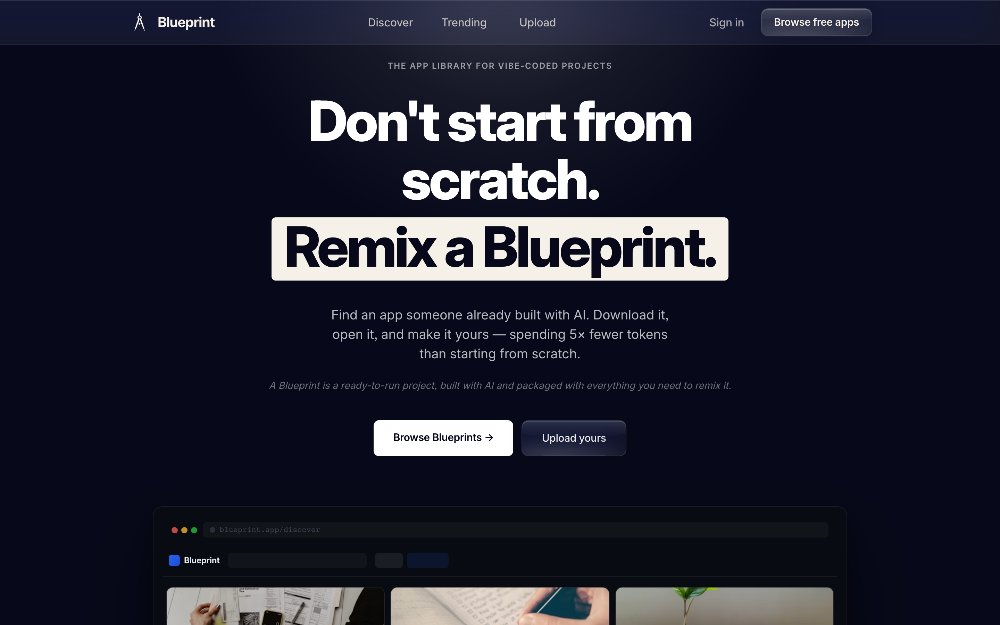

# Blueprint

[](https://github.com/Lucassnam/vibemesh/actions/workflows/ci.yml)

A marketplace concept for AI built apps. Instead of starting from an empty
prompt, you download a working base, remix it, and ship your version for a
fraction of the tokens.



> **Status: prototype.** This is a design and interaction study, not a running
> marketplace. There are no real listings and no payments. Treat the numbers on
> screen as placeholder content.

## What is built

- Home page with the pitch, an animated app mockup and a category browser
- Discover and Trending routes
- Upload flow for publishing a blueprint
- Auth routes, signin, signup and profile, backed by Supabase
- A liquid glass surface treatment used across the buttons and cards

## Stack

Next.js 16 with the App Router, React 19, TypeScript, Supabase for auth, and
Playwright for the interaction test in `tests/`.

## Running it locally

```bash
npm ci
npm run dev
```

Create `.env.local` with:

```
NEXT_PUBLIC_SUPABASE_URL=https://your-project.supabase.co
NEXT_PUBLIC_SUPABASE_ANON_KEY=your-anon-key
SUPABASE_SERVICE_ROLE_KEY=your-service-role-key
```

Middleware constructs a Supabase client on every request, so without these the
app returns a 500 rather than degrading, even on the home page.
